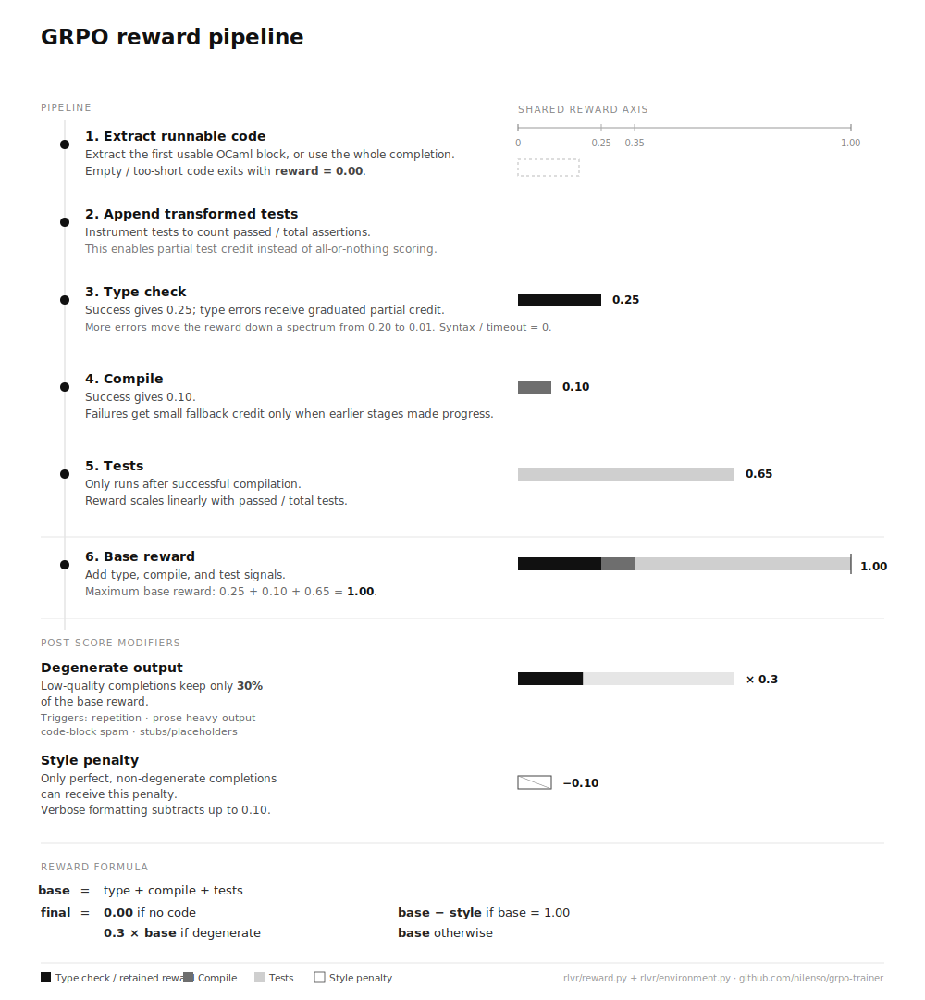
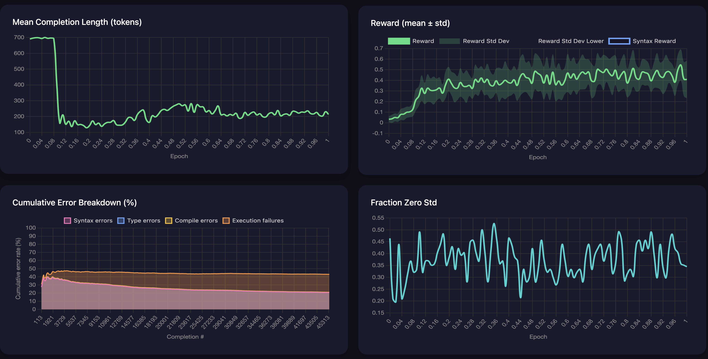
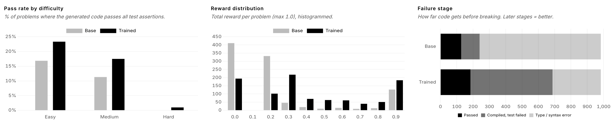
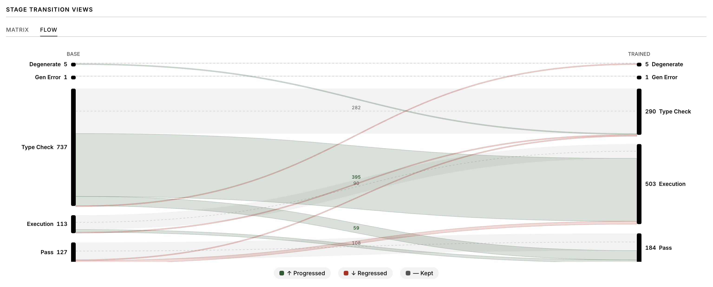
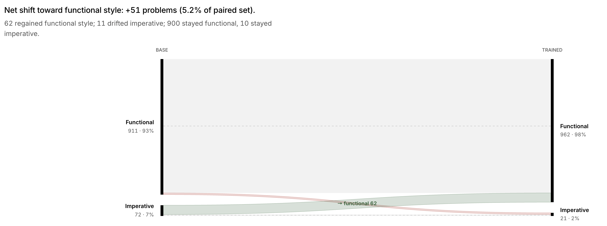
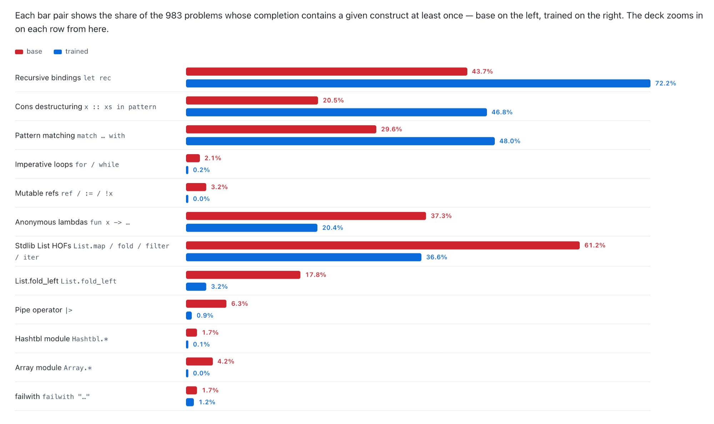
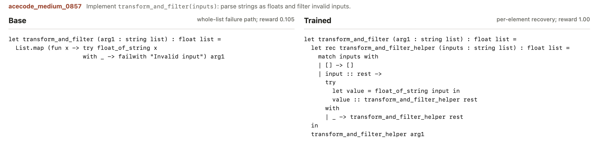
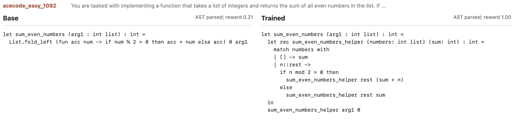
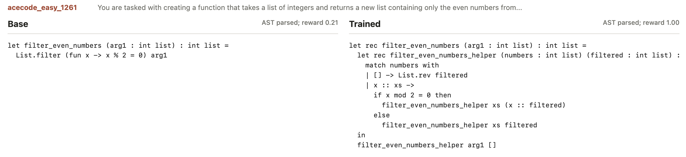

+++
title = 'Training a small model to write better OCaml with RLVR and GRPO'
date = 2026-05-18T00:00:00+05:30
draft = false
+++

> _Note: This was originally posted on the [nilenso blog](https://blog.nilenso.com/blog/2026/05/18/training-a-small-model-to-write-better-ocaml-with-rlvr-and-grpo/)._

For a while now, I’ve been interested in [exploring the capabilities of small language models](https://blog.nilenso.com/blog/2025/05/06/local-llm-setup/). When my colleague [Atharva](https://x.com/AtharvaRaykar) introduced me to RLVR and GRPO for doing RL training without a human feedback loop, I wanted to know more. 

In the [previous post](https://blog.nilenso.com/blog/2026/01/28/reinforcement-learning-with-grpo/), we explored the workings of RLVR and GRPO. In this post, I’ll walk through a code-generation experiment where I trained a small 1.5B model with GRPO, improved its ability to generate correct and valid OCaml code, and share what I learned along the way. 

It started with a simple hypothesis: 

“*Can training a small local model on OCaml code generation using RLVR and GRPO give me a much better model that can help me explore the language and write better OCaml code?*” 

The small model that I eventually chose was trained on public GitHub repositories across 92 programming languages. Since OCaml is a relatively niche language in this mix, the setting was a good fit for evaluating how well RLVR could improve the model's capabilities.

I had some idea about training models, but not enough to make all the design decisions. I needed an anchor to get started.

# Constraints keep you focused

Given the broad spectrum of decisions to make, I wanted to define some requirements upfront to keep things simple and focused.

- **Local inference**: train a small model that can be run on my M2 Pro with 16 GB RAM. After some testing, I decided to use [Qwen2.5-Coder-1.5B-Instruct](https://huggingface.co/Qwen/Qwen2.5-Coder-1.5B-Instruct-GGUF) as the base model. It did the best in my small eval dataset amongst similar models in that class. It also had a *relatively better* knowledge of the OCaml syntax and could solve trivial problems.
- **Single GPU**: train the model on a single rented GPU. I decided to use an RTX 6000 with 48GB of VRAM. The full fine-tuning of the model would’ve been feasible, but tight, when accounting for the model weights, gradients, optimizer states, activations, and GRPO rollouts. LoRA made it more practical by training only ~37M adapter parameters, significantly reducing training memory. It also gave me more room to experiment with different training configurations.
- **Fast dev feedback loop**: sanity test the training code on my Mac quickly before the actual run. I was dabbling with [Nix](https://nix.dev/manual/nix/2.28/introduction.html) at the time and used it to create the platform-specific environments. I eventually used it for training in production as well.
- **Training and test dataset**: use a small dataset of programming problems with varied difficulty for both training and evaluation. I could not find a good OCaml dataset to use, so I ended up porting a subset of the [AceCode-87K](https://huggingface.co/datasets/TIGER-Lab/AceCode-87K) dataset with tests to OCaml using Claude with some programmatic verification steps. The evaluation dataset was generated using a combination of 99lisp, leetcode and AceCode problems of varying difficulty in terms of the concepts covered and reasoning effort required.
- **Training loop**: work with simple abstractions for the actual training loop. Instead of writing a custom GRPO implementation, I used [Hugging Face’s trl library](https://huggingface.co/docs/trl/index) because it already supported [GRPOTrainer](https://huggingface.co/docs/trl/grpo_trainer) with PEFT/LoRA integration, working with Hugging Face datasets, and useful logging hooks.

# Reward functions shape the learning trajectory

In the [previous blog post about RLVR and GRPO](https://blog.nilenso.com/blog/2026/01/28/reinforcement-learning-with-grpo/), we saw that reward design is central to how the model learns. When a lot of OCaml solutions failed early, a binary pass/fail reward provided little-to-no information for learning. I ended up using a graduated reward system that recognized nuanced progress across type-check, compilation, and test phases while penalizing degenerate completions. 



# The knobs that shaped learning

Since the previous post already explained the mechanics of GRPO, I’ll skip the parameter glossary here. In this section, we'll look at a small set of parameters that impacted model learning more than the rest:

- **Number of generations per prompt** controlled how much relative signal GRPO had. Too few samples made most groups look identical; more samples improved comparison but increased rollout cost.
- **Sampling temperature and `top_p`** controlled exploration. More randomness helped when the model was failing early, but too much produced noisy OCaml and made rewards harder to interpret.
- **KL penalty** kept the trained model from drifting too far from the base model’s capabilities. Too much slowed learning; too little made collapse easier.
- **Gradient clipping** helped keep updates bounded as reward variance increased. Without it, training was more prone sudden instability.
- **Completion length** affected both cost and behavior. Longer completions gave the model more tokens to solve problems, but also made rambling and code-block spam more likely.
- **LoRA rank and target modules** controlled how much the model could adapt while keeping the run feasible on a single GPU.

These knobs were tightly coupled. Increasing exploration could improve reward diversity, but it also made training less stable. Increasing stability reduced the reward variation that GRPO needed to learn. Most of the tweaking was about managing these trade-offs in a reasonable way.

# Setting up the training harness

Now that we have the basic ingredients, we need a recipe to put it all together. The TRL library provides a good interface for doing this with `GRPOTrainer`. 

At a high level, the training loop looked like this:

```python
# 1. Reward function: grade one generated OCaml solution.
# Given the model's completion and the problem's tests, 
# return a scalar reward
def grade_ocaml_solution(completion, info, state):
    reward, metadata = compute_reward(
        generated_solution=completion,
        unit_tests=info["tests"],
        problem_id=info["problem_id"],
    )
    return reward

# 2. Load the training dataset from Hugging Face
raw_dataset = load_dataset("kiranpg/ocaml-training-problems", split="train")
train_dataset = raw_dataset.map(
    lambda row: {
        "prompt": render_prompt(row["prompt"], problem_id=row["id"]),
        "problem_id": row["id"],
        "tests": row["tests"],
    }
)

# 3. TRL reward adapter to score a batch of completions at once
def reward_func(prompts, completions, problem_id=None, **columns):
    rewards = []

    for i, completion in enumerate(completions):
        info = {
            "problem_id": problem_id[i],
            "tests": columns["tests"][i],
        }
        rewards.append(
            grade_ocaml_solution(
                completion=completion,
                info=info,
                state={},
            )
        )

    return rewards

# 4. Wire the dataset, reward function, tokenizer, and LoRA config into GRPOTrainer
trainer = GRPOTrainer(
    model="base-model",
    train_dataset=train_dataset,
    reward_funcs=[reward_func],
    args=GRPOConfig(...),
    processing_class=tokenizer,
    peft_config=LoraConfig(...),
)

# 5. Start training
trainer.train()
```

# Creating feedback loops for faster experimentation

It is critical to monitor training closely from the start. Metrics can show you if the run is moving in the right direction. But to understand what the model is actually learning (OCaml constructs, code styling patterns, shortcuts and reward-hacking behavior), pay close attention to the generated completions.



The most useful metrics that helped me understand a run were:

- **Reward distribution**: Mean and standard deviation of rewards within each completion group. The mean tracked progress and the standard deviation showed whether the completions were meaningfully different.
- **Policy loss**: GRPO objective value being optimized. Near-zero values for long stretches usually meant little learning signal while sharp spikes suggested unstable updates.
- **Gradient norm**: Size of model update for each step. Spikes meant unstable training while near-zero values meant the model was barely changing.
- **Learning rate**: How big a step the optimizer takes when updating the model. Higher values meant faster learning that could become unstable while very low values meant slow or no learning.
- **Entropy**: Variation in the model’s choice of tokens. Higher entropy meant more exploration while very low entropy meant the model was becoming predictable.
- **KL divergence**: Measure of divergence between the trained policy and the reference policy. High KL meant the model was drifting aggressively from the base model — a sign of learning, but also hinting at instability or reward hacking. Low KL meant the model was staying close to its original behavior, which was safer but could also mean it was not learning much.
- **Fraction zero reward std**: Fraction of prompts where all generated completions received identical rewards. High values meant GRPO had little signal to learn from. A low value meant more reward diversity, giving the model more signal to learn from.
- **Mean completion length**: Average length of generated completion. Increasing lengths often meant rambling or max-token behavior while sharp drops indicated collapse.
- **Cumulative error breakdown**: Breakdown of failures across reward components such as type-check, compilation, and passing tests. Changes in the breakdown showed whether the model was improving in the right direction or optimizing one part of the reward pipeline.

# Training Impact on Model Capabilities

On a synthetic evaluation set of 1k problems ([nilenso/ocaml-eval-problems](https://huggingface.co/datasets/nilenso/ocaml-eval-problems)) adapted from multiple sources, the trained model generated *more correct solutions* and *much more compilable code* than the base model.



The biggest shift was not just in pass rate, but in *failure mode*. The base model often failed at the type/syntax stage, while the trained model moved many of those attempts into compiled-but-test-failed territory. That meant the model was producing code that was closer to executable OCaml, even when it was still wrong.

The trained model solved more easy and medium difficulty problems and made a small improvement solving a hard problem. The bigger win, however, was in producing more valid code: it compiled seven of every ten attempts compared with two out of ten for the base model.



### Shifting towards a more functional style

Along with the improvement in writing valid code, the trained model started favoring a more functional style for solving problems. Overall, imperative solutions became rarer, dropping from 7% to 2%.



Here’s an example solution that hints at the shift:

Base

```ocaml
let get_exchange_rate (arg1 : string list) : (string * 'a) list =
  let rates = ref [] in
  List.iter (fun cmd ->
    let parts = String.split_on_comma cmd in
    let source = List.nth parts 0 in
    let target = List.nth parts 1 in
    let rate = List.nth parts 2 in
    if rate <> "" then
      rates := (source ^ "-" ^ target, float rate) :: !rates
  ) arg1;
  !rates
```

Trained

```ocaml
let get_exchange_rate (arg1 : string list) : (string * 'a) list =
  let rec get_exchange_rate_helper (commands : string list) : (string * 'a) list =
    match commands with
    | [] -> []
    | command :: rest ->
      let parts = String.split_on_char ',' command in
      if List.exists (fun part -> String.starts_with "rate=" part) parts then
        let s = List.hd ( parts |> List.filter (fun part -> String.starts_with "rate=" part) ) in
        let rate = String.sub s 5 (String.length s - 5) in
        ("USD-EUR", rate) :: get_exchange_rate_helper rest
      else
        get_exchange_rate_helper rest
  in
  get_exchange_rate_helper arg1

```

### Code-level insights

The trained model uses pattern-matching more, avoiding nested conditionals and unnecessary or premature `failwith "..."`. It uses fewer imperative constructs (`for` loops, `ref` and bang dereferences, and `:=` assignments), and often prefers tail-recursive helpers over the quadratic non-tail-recursive patterns that the base model uses.



In an interesting example, the base model catches failures inside a mapper function and re-raises them with `failwith`, which breaks the entire processing flow on any failure. In contrast, the trained model uses the accumulator pattern, ignores the failed input, and continues processing.



It’s not all sunshine and rainbows, though. The trained model regressed in a few areas. Specifically, it overused recursive helpers for list-shaped problems, while the base often reached for concise `List` functions. For example, while the base model uses `List.nth/hd` for indexing and `List.fold/map/filter` for processing, the trained model prefers manual list traversal using recursion, decomposition, and pattern-matching.





While correctness was the only training objective, it’s interesting to see how the model arrived at a consistent *style*: explicit recursion, pattern matching, fewer mutations, and fewer stdlib shortcuts (sometimes to its detriment).

# Learnings

This entire experiment felt less like training a model and more like hardening the reward functions from being gamed by the model. In hindsight, there are a few things I wish I knew from the start:

**Reward shaping is a double-edged sword**

The model tends to choose the *cheapest* path to seek a reward. Expect a lot of reward-hacking behavior.

- The model found multiple cheap shortcuts before it learned useful OCaml behavior. One run collapsed into `(* BEGIN *)` / `(* END *)` marker spam. Another fell back to natural-language responses and junk text. Another discovered markdown code-block spam because a reward bug gave malformed fenced output a consistent partial score.
- Instruction-tuned models can bring hidden conversational failure modes into RL training. When the model was unsure about OCaml, it often reached for responses like “I apologize...” or “To solve this...” instead of code. Since those outputs could receive the same `0.0` reward as a serious-but-failed code attempt, the reward function initially gave the model little reason to stop doing it. The takeaway is that a `0.0` reward could mean gibberish output or an almost correct solution. Look at the generated completions along with the metrics to capture patterns to penalize.
- When working with a small base model that had a weak knowledge of OCaml, using binary rewards resulted in a tiny pass ratio that provided little signal to learn from. The model was unable to distinguish between gibberish response vs a near-miss. Using graduated rewards emphasized this distinction and gave the model a usable signal to follow.
- The graduated rewards, while helpful, also created local optima. The model often settled for consistent mediocre rewards rather than risking correct solutions.
- Managing reward diversity and training stability is a balancing act: too little diversity led to minimal learning but increasing variance increased the risk of unstable updates. Combining a penalty multiplier with gradient clipping provided the most robust solution.
- The model got better at producing valid code that passed tests, but regressed on using idiomatic stdlib functions.

Diagnosing the reward pipeline — inspecting the actual completions, analyzing failures, and making judgements — took most of my time and effort.

**Optimize for fast feedback loops**

Make the training process more *observable* to create effective feedback loops to detect failure modes and shape training.

- The most valuable metric wasn’t loss, it was whether different samples for the same prompt got different rewards at all.
- The training can regress model behavior in unexpected ways. For example, the model learned a "helper-function" idiom during RLVR and now over-applies it — sometimes breaking a problem the base solved in three lines.
- Training checkpoints are important for experimentation. In case of a model collapse, it allows going back in time (epoch) and resuming with different settings. Starting from scratch for every experiment/tweak is both exhausting and expensive (as I learned the hard way).

**Use AI to accelerate iteration**

Using AI can be a productivity multiplier. It helped me think at a higher level to design the training and inform my judgement. In practice, that meant using it as a research assistant across the loop:

- Generating synthetic datasets for training and evaluation
- Setting up the training loop after providing a few design decisions
- Suggesting initial hyperparameters based on model and environment constraints
- Debugging PyTorch <> CUDA version mismatches
- Building and Iterating on training and evaluation dashboards
- Understanding training progress and learning trends from training logs
- Doing a thorough analysis of failure modes and preparing RCAs with action items

AI accelerated the experimentation, but reward shaping still required manual inspection and judgement.

**Training longer != learning more**

- With ~10,000 training problems and GRPO's group‑relative advantage, the model converged within 1.5 epochs with very little learning after. In fact, more epochs can reinforce existing shortcuts if the reward signal has stopped producing meaningful variation.
- Evaluate intermediate checkpoints because the best model may appear before the final step
- The goal is not to train until the run finishes, but to notice when the model has *stopped improving*

# Closing Thoughts

Revisiting the hypothesis from earlier:

> *“Can training a small local model on OCaml code generation using RLVR and GRPO give me a much better model that can help me explore the language and write better OCaml code?”*
> 

I think, yes. The model did improve significantly in writing more valid/compilable code, and somewhat more correct code, but with caveats. The biggest takeaway for me is that *RLVR is less about simply training a model and more about designing the right incentives and feedback loops to enable learning.*

All of this took a while, but it was a fun and frustrating experiment to explore the practicalities of improving the capabilities of a small local model. The experience taught me a lot more than I had anticipated.

The trained model is available as [nilenso/Qwen2.5-OCamler-1.5B-Instruct](https://huggingface.co/nilenso/Qwen2.5-OCamler-1.5B-Instruct) on Hugging Face, and the training code and evaluation runner/viewer are available on GitHub at [nilenso/grpo-trainer](https://github.com/nilenso/grpo-trainer).
